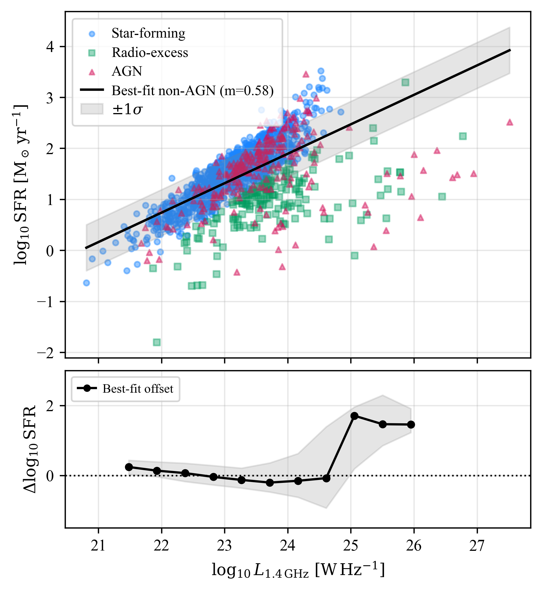

# Quantifying the Maximum Recoverable Variance in Star Formation Rate from 1.4 GHz Radio Continuum Emission

## Authors

- Jason Shingirai Makechemu
- James O. Chibueze
- Brooke D. Simmons

---

## Overview

This repository contains the preprint, figures, and supplementary materials for our study investigating the informational limits of 1.4 GHz radio continuum emission as a tracer of galaxy star formation rate (SFR) across environment and cosmic time.

Using deep multi-wavelength observations from the VLA–COSMOS survey and the MeerKAT Galaxy Cluster Legacy Survey (MGCLS), we assess how much information about galaxy star formation can be recovered from radio luminosity alone using both linear and non-linear machine learning approaches.

---

## Abstract

Radio continuum emission at ~1.4 GHz is widely employed as a dust-insensitive tracer of star formation rate (SFR) and forms a key science driver for current and forthcoming deep radio surveys. We reassess the radio–SFR connection using deep multi-wavelength data for field galaxies from the VLA–COSMOS survey and cluster galaxies from the MeerKAT Galaxy Cluster Legacy Survey, spanning 0 < z ≲ 6.5.

Using a suite of linear and non-linear regression models trained on radio-only inputs, we quantify the recoverable variance in SFR. Across all models, predictive performance saturates at R² ~ 0.40–0.45, indicating that more than half of the intrinsic variance in SFR is not encoded in 1.4 GHz luminosity alone.

The empirical radio–SFR relation exhibits substantial intrinsic scatter and a slope significantly shallower than unity, implying luminosity-dependent biases if proportional calibrations are assumed. Removing radio-excess sources tightens the observed relation, but these systems cannot be robustly identified or excluded using radio data alone and likely represent a physically heterogeneous population rather than a clean AGN class.

These results suggest that robust radio-based SFR inference in the MeerKAT and Square Kilometre Array era will require probabilistic or multi-wavelength approaches that explicitly account for intrinsic scatter and environmental modulation.

---

## Example Result



## Key Results

- Radio-only models saturate at R² ≲ 0.45
- More than half of SFR variance is unrecoverable from radio luminosity alone
- The radio–SFR relation contains substantial intrinsic physical scatter
- Environmental effects degrade predictive performance within cluster environments
- Removing radio-excess sources artificially tightens the relation but is not physically well justified
- Increasing model complexity does not recover significantly more predictive information

---

## Paper

📄 [Read the preprint PDF](paper/paper.pdf)

---

## Repository Structure

```text
paper/          -> Manuscript PDF and LaTeX source
figures/        -> Figures used in the paper
scripts/        -> Data processing and ML scripts
